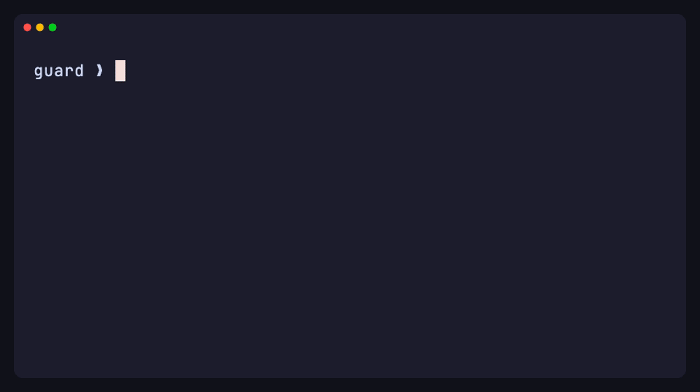

# herdr-guard

Cross-agent command policy for [Herdr](https://herdr.dev): watch every pane,
audit risky commands, notify you, and best-effort interrupt dangerous shell
input.



_Scripted dry-run using the real policy engine; the displayed command is never
executed._

## Coverage (honest contract)

| Pane | Guard sees | Interrupt guarantee |
| --- | --- | --- |
| Interactive zsh/bash | Typed and unsubmitted input | Strong pre-execution cancel via `ctrl+c` |
| Raw/no-echo shell | Nothing typed | None; `stty -echo` is alerted |
| Pi/Claude/Codex TUIs | Only rendered terminal text | Incidental; harness hooks remain authoritative |
| Logs/builds | Printed output | Best-effort while process is running |
| Herdr popups | Nothing in v1 | Blind spot |

This is a text policy layer, not intent analysis. Shell obfuscation, detached
nested multiplexers, popup panes, and a stopped/disabled guard are documented
limitations. Use native agent hooks for authoritative tool-call enforcement.

## Install

```sh
herdr plugin install StructuPath/herdr-guard
```

For local development:

```sh
herdr plugin link /path/to/herdr-guard
```

The startup hook seeds the per-user rules file and idempotently opens the Guard
pane. You can also focus or reopen it from the plugin action list with
`structupath.guard.open`. The pane subscribes to Herdr's
`pane.output_matched` events and maintains a local `pane.read` sweep backstop.
It does not modify other panes during installation.

## Actions

- **Open guard** — launch the dashboard pane.
- **Pause enforcement** — pause actions for 15 minutes; matches remain audited.
- **Resume enforcement** — reactivate immediately.
- **Test a command** — dry-run text against active rules.
- **Reset guard rules** — back up and reseed defaults.

## Configuration

Rules live at `$HERDR_PLUGIN_CONFIG_DIR/rules.json`; runtime audit files live
at `$HERDR_PLUGIN_STATE_DIR`. Both directories are private (`0700`) and files
are written `0600`. The configuration supports `audit`, `alert`, and
`interrupt` severity, `regex` or `substring` matching, and `prompt_only`.

A workspace may add substring rules in `.herdr-guard.json`. Project rules and
severity raises are always capped at `alert`; repository-controlled regex and
interrupt rules are rejected. Workspace rules cannot disable or lower global
rules unless the user explicitly enables `allow_project_override` in the
global configuration. Configuration writes are atomic and malformed updates
keep the last known-good policy.

The shipped policy covers destructive filesystem/Git/infrastructure commands,
secret-file reads, publishing, data exfiltration, and evasion indicators such
as `stty -echo`, detached tmux/screen, `disown`, base64-to-shell, and eval
subshells. Review the defaults before enabling interrupt rules in production.

## Security and trust

This plugin is ordinary local code with the same privileges as Herdr and the
user who installs it. Herdr plugins are not sandboxed or reviewed. Inspect the
manifest and source before installing. The audit log contains sensitive
metadata even after token redaction; protect and rotate it appropriately.

The guard is advisory against a process that can disable the plugin, kill its
pane, stop Herdr, or use an unobserved popup/nested session. The socket API has
no plugin-specific read-only ACL in the current Herdr release. Events are
reconciled with baseline suppression to avoid replayed scrollback triggering a
fresh interrupt, and interrupt matches are intentionally never deduplicated.

## Development

Requirements: Herdr 0.7.5+, Node.js 20+, macOS or Linux.

```sh
npm test
herdr plugin link .
herdr plugin list
```

Tests use a fake NDJSON socket and temporary config/audit directories; they do
not open panes or invoke live actions. The implementation uses plain ESM Node
with no runtime dependencies.

The demo is reproducible with [VHS](https://github.com/charmbracelet/vhs):

```sh
vhs assets/demo.tape
```

## Future work

- Harness reporters for Pi/Claude Code tool calls.
- Shell pre-exec approval flow.
- Popup visibility in Herdr's event/API surface.
- Per-plugin socket ACLs or read-only tokens.
- Windows and named-session aggregation.

MIT licensed.
