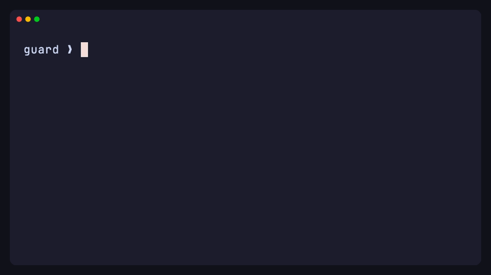

# herdr-guard

Cross-agent command policy for [Herdr](https://herdr.dev): watch every pane,
audit risky commands, notify you, and best-effort interrupt dangerous shell
input.

Current runtime and manifest release: **0.2.0**.

**Docs:** the [StructuPath Herdr Plugins wiki](https://github.com/StructuPath/herdr-browser/wiki)
is the practical guide to this plugin and its three siblings (Browser, Swarm,
Conductor).



_Scripted dry-run using the real policy engine; the displayed command is never
executed._

## Coverage (honest contract)

| Pane | Guard sees | Interrupt behavior |
| --- | --- | --- |
| Shell (zsh/bash) | Typed input | Best-effort request; prevention unknown |
| Raw/no-echo shell | Nothing typed | No request; `stty -echo` alerts |
| Agent TUIs | Rendered text | Usually none; harness hooks are authoritative |
| Logs/builds | Printed output | None unless classified as a shell |
| Herdr popups | Nothing in v1 | Blind spot |

For a shell match, Guard records whether Herdr accepted the request. Acceptance
is not proof that the process received Ctrl+C or that execution changed.

This is a text policy layer, not intent analysis. Shell obfuscation, detached
nested multiplexers, popup panes, and a stopped/disabled guard are documented
limitations. For authoritative tool-call enforcement inside agent harnesses,
use the bundled harness reporter (below) or native agent hooks.

## Harness reporter (pre-execution enforcement)

Pane-watching can only *request* an interrupt after text renders. The
reporter path inverts that: an agent harness reports each tool call to the
guard **before execution** over a local unix socket
(`~/.local/state/herdr-guard/reporter.sock`, dir `0700`) and receives a
verdict from the same policy — `deny` (interrupt-tier), `warn` (alert-tier),
or `allow`. Reported commands are matched raw (prompt-only gating does not
apply) and audited with `source: "harness:<agent>"`; project overrides apply
by the reported `cwd`.

A ready-made Claude Code `PreToolUse` hook ships in
`hooks/claude-code-pretooluse.mjs` — it maps `deny` to a blocked tool call
and `warn` to a permission prompt. Wire it in `settings.json`:

```json
{
  "hooks": {
    "PreToolUse": [
      {
        "matcher": "Bash",
        "hooks": [
          {
            "type": "command",
            "command": "node /path/to/herdr-guard/hooks/claude-code-pretooluse.mjs"
          }
        ]
      }
    ]
  }
}
```

The hook is strictly fail-open: if the guard is not running, times out, or
answers garbage, the tool call proceeds and nothing breaks. The guard cannot
observe whether a harness honored a verdict, so audit entries still record
`prevention: "unknown"`. Other harnesses can implement the same one-line
NDJSON protocol: send
`{"v":1,"kind":"tool_call","agent":"pi","tool":"shell","command":"...","cwd":"..."}`
and read back `{"ok":true,"verdict":"deny","rule_id":"...","reason":"..."}`.

## Install

```sh
herdr plugin install StructuPath/herdr-guard
```

For local development:

```sh
herdr plugin link /path/to/herdr-guard
```

The startup hook seeds the per-user rules file and idempotently opens the Guard
pane. You can also focus or reopen it from the plugin action list with
`structupath.guard.open`. The pane subscribes to Herdr's
`pane.output_matched` events and maintains a local `pane.read` sweep backstop.
It does not modify other panes during installation.

## Actions

- **Open guard** — launch the dashboard pane.
- **Pause enforcement** — pause actions for 15 minutes; matches remain audited.
- **Resume enforcement** — reactivate immediately.
- **Test a command** — dry-run text against active rules.
- **Reset guard rules** — back up and reseed defaults.

## Configuration

Rules live at `$HERDR_PLUGIN_CONFIG_DIR/rules.json`; runtime audit files live
at `$HERDR_PLUGIN_STATE_DIR`. Both directories are private (`0700`) and files
are written `0600`. The configuration supports `audit`, `alert`, and
`interrupt` severity, `regex` or `substring` matching, and `prompt_only`.

A workspace may add substring rules in `.herdr-guard.json`. Project rules and
severity raises are always capped at `alert`; repository-controlled regex and
interrupt rules are rejected. Workspace rules cannot disable or lower global
rules unless the user explicitly enables `allow_project_override` in the
global configuration. Configuration writes are atomic and malformed updates
keep the last known-good policy.

The shipped policy covers destructive filesystem/Git/infrastructure commands
(including cloud-resource deletion on AWS/GCP/Azure, PaaS app destruction,
Kubernetes/Helm teardown, and database `DROP`/`TRUNCATE` statements),
secret-file and credential reads, package publishing, data exfiltration
(`scp`/`rsync` of key directories, `curl` uploads of secret material), guard
tampering (`herdr plugin disable`, killing Herdr, deleting rules or audit
files), and evasion indicators such as `stty -echo`, detached tmux/screen,
`disown`/`setsid`, history clearing, and base64/hex-to-shell decoding. Every
rule ships with hit and near-miss tests (`tests/rules-default.test.mjs`);
`git push --force-with-lease`, `id_rsa.pub` reads, and similar benign
neighbors are explicitly kept silent. Review the defaults before enabling
interrupt rules in production.

## Security and trust

This plugin is ordinary local code with the same privileges as Herdr and the
user who installs it. Herdr plugins are not sandboxed or reviewed. Inspect the
manifest and source before installing. The audit log contains sensitive
metadata even after token redaction; protect and rotate it appropriately.

The guard is advisory against a process that can disable the plugin, kill its
pane, stop Herdr, or use an unobserved popup/nested session. An accepted
`pane.send_keys` request does not prove that a process received Ctrl+C or that
execution changed. The socket API has
no plugin-specific read-only ACL in the current Herdr release. Events are
reconciled with baseline suppression to avoid replayed scrollback triggering a
fresh interrupt, and interrupt matches are intentionally never deduplicated.

## Development

Requirements: Herdr 0.7.5+, Node.js 20+, and the platform lock utility (`lockf` on macOS or `flock` on Linux).

```sh
npm test
herdr plugin link .
herdr plugin list
```

Tests use a fake NDJSON socket and temporary config/audit directories; they do
not open panes or invoke live actions. The implementation uses plain ESM Node
with no runtime dependencies.

The demo is reproducible with [VHS](https://github.com/charmbracelet/vhs):

```sh
vhs assets/demo.tape
```

## Future work

- Additional harness reporters (Pi extension, Codex) speaking the shipped
  reporter protocol.
- Shell pre-exec approval flow.
- Popup visibility in Herdr's event/API surface.
- Per-plugin socket ACLs or read-only tokens.
- Windows and named-session aggregation.

MIT licensed.
